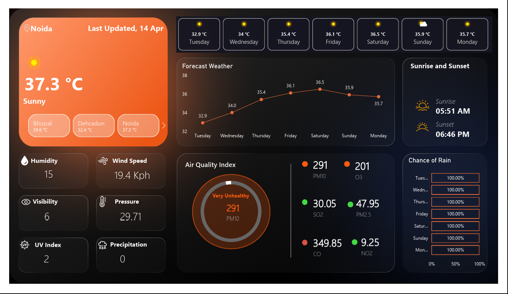

# 🌦️ Real-Time Weather Dashboard (Power BI)

## 📌 Project Overview
This project is a **Real-Time Weather Dashboard** built using **Power BI** by integrating a live Weather API.  
The dashboard provides up-to-date weather insights, forecasts, and air quality metrics in an interactive and visually appealing format.

The main objective of this project is to demonstrate how real-time data can be fetched, transformed, and visualized effectively using Power BI.

---

## 🚀 Features
- 🌡️ Real-time temperature updates
- ☁️ Current weather conditions (Sunny, Cloudy, etc.)
- 💧 Humidity tracking
- 🌬️ Wind speed monitoring
- 👁️ Visibility data
- الضغط Pressure insights
- 🌅 Sunrise & Sunset timings
- 📅 7-day weather forecast
- 🌧️ Chance of rain analysis
- 🏭 Air Quality Index (AQI)
  - PM2.5
  - PM10
  - NO2
  - CO
  - O3

---

## 🛠️ Tools & Technologies
- **Power BI** – Data visualization and dashboard design  
- **Weather API** – Real-time data source  
- **Power Query** – Data transformation and cleaning  

---

## 🔄 Data Flow
1. Weather data is fetched from a live API  
2. Data is imported into Power BI using Power Query  
3. Data is cleaned and transformed  
4. Relationships and models are created  
5. Visualizations are built using charts, cards, and graphs  
6. Dashboard updates dynamically based on API data  

---

## 📊 Dashboard Highlights
- Multi-city weather comparison  
- Weekly forecast visualization  
- AQI indicators with health-level classification  
- Interactive and user-friendly layout  

---

## 📚 Key Learnings
- Working with **real-time APIs**
- Data transformation using **Power Query**
- Building **interactive dashboards**
- Visualizing environmental and time-series data  
- Improving UI/UX in Power BI dashboards  

---

## 📸 Preview

## 📸 Preview

  

---

## 📂 How to Use
1. Download the `.pbix` file  
2. Open in Power BI Desktop  
3. Update API key (if required)  
4. Refresh the data to view real-time updates  

---

## 💡 Future Improvements
- Add more cities dynamically  
- Implement alerts for extreme weather conditions  
- Enhance UI with custom themes  
- Automate API refresh scheduling  

---

## 🤝 Contributing
Contributions are welcome! Feel free to fork this repo and improve the dashboard.

---

## 📬 Contact
If you have any suggestions or feedback, feel free to connect with me.
